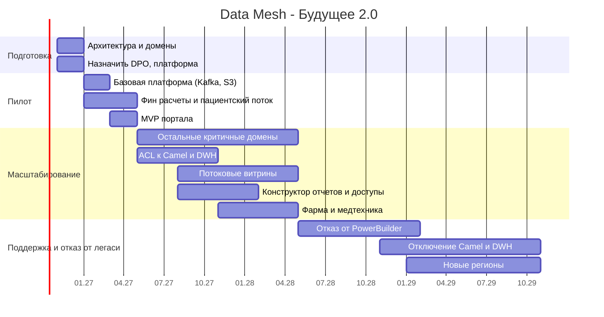

# Роадмап внедрения Data Mesh

## Роли

| Роль | Где | Что делает |
|---|---|---|
| Data Product Owner | в каждом домене | отвечает за data products домена: что в них, качество, кто потребители, SLA |
| Data Engineer | в каждом домене | делает пайплайны и витрины домена, публикует события и data products |
| BI-аналитик | в домене или в головном офисе | строит отчеты в портале, собирает требования бизнеса, проверяет цифры |
| Платформенная команда | центр | Kafka, lakehouse, портал, каталог, шаблоны. Делает так, чтобы доменам было легко |
| Data Governance (архитектор + ИБ + юрист) | центр | общие правила: схемы, классификация данных, доступы, требования регуляторов |

## Этапы

### Этап 0. Подготовка (0-2 мес)
Бизнес-цель: архитектура согласована, границы доменов определены (промежуточное состояние).
- согласовать целевую архитектуру и этот роадмап
- event storming с бизнесом, зафиксировать домены и bounded contexts
- назначить Data Product Owner в пилотных доменах
- собрать платформенную команду
- выбрать облако с учетом требований к медицинским и банковским данным
- спланировать проекты по витринам в каждом домене

### Этап 1. Пилот (2-6 мес)
Бизнес-цель: проверить подход на 1-2 доменах.
- поднять базовую платформу через Terraform: Managed Kafka, Schema Registry, DLQ, Object Storage, ClickHouse
- пилотные домены: финансовые расчеты и пациентский поток
- первые события по каталогу и первые data products (счета, платежи, визиты)
- CDC из DWH для данных, которые пилоту нужны из легаси
- MVP портала: 5-10 ключевых отчетов, доступ через Keycloak
- правила: схемы событий, классификация данных, медданные не идут в аналитику
- результат: отчеты по пилотным доменам за минуты, а не часы

### Этап 2. Масштабирование (6-18 мес)
Бизнес-цель: портал самообслуживания работает, домены работают с данными в новой архитектуре (финальное состояние через год).
- подключаем остальные критичные домены: финтех целиком, головной офис, ИИ (только метаданные)
- anti-corruption layer к Camel и DWH
- потоковые витрины на Flink
- конструктор отчетов в портале, row/column-level доступ через OPA
- каталог данных DataHub: владельцы, схемы, lineage
- Data Product Owner и Data Engineer в каждом домене
- подключаем фарму и медтехнику сразу через события
- выключаем первые отчеты в Power BI и первые маршруты Camel
- к 12 месяцу: портал запущен для всех доменов, легаси в отдельных доменах еще допускается

### Этап 3. Поддержка доменов и отказ от легаси (18-36 мес)
Бизнес-цель: событийная платформа, near-real-time, выход в новые регионы.
- на критическом пути нет синхронных точечных интеграций
- PowerBuilder заменен web-кабинетом
- Camel и DWH отключены, архивы в холодном хранилище
- доменная аналитика на потоках
- платформа разворачивается в новых регионах из Terraform с учетом местных законов
- data products для монетизации ИИ-функций и новых финтех-продуктов
- платформенная команда переходит в режим поддержки и развития

## Диаграмма

## Как понимаем, что все идет нормально

| Этап | Метрика |
|---|---|
| Пилот | отчеты по пилотным доменам строятся за минуты, 2 домена публикуют события |
| Масштабирование | все критичные домены имеют data products и DPO, 70% отчетов в портале |
| Поддержка | 0 синхронных интеграций на критическом пути, DWH и Camel выключены, данные в портале с задержкой минуты |